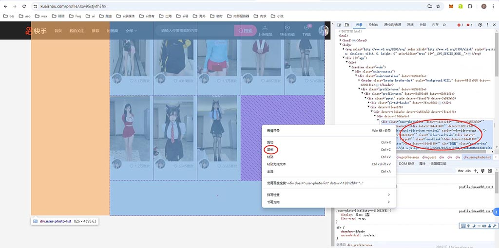
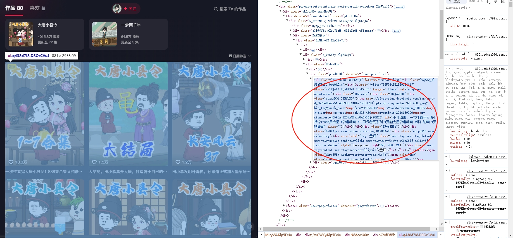
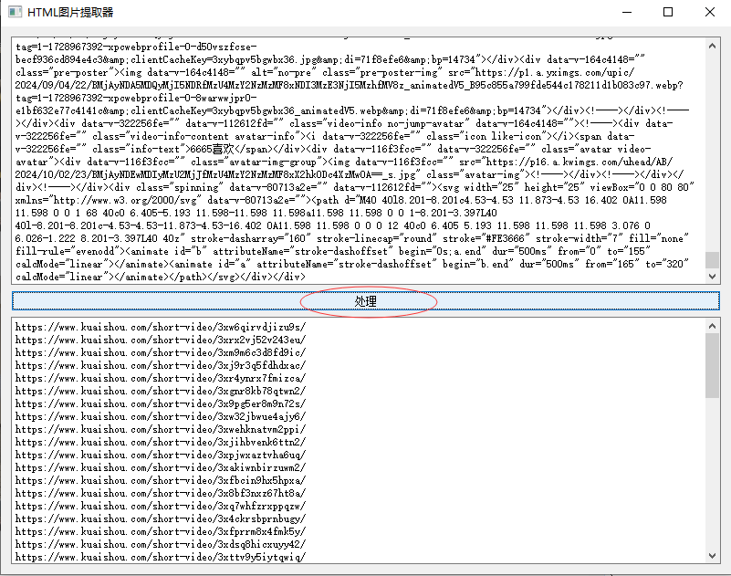
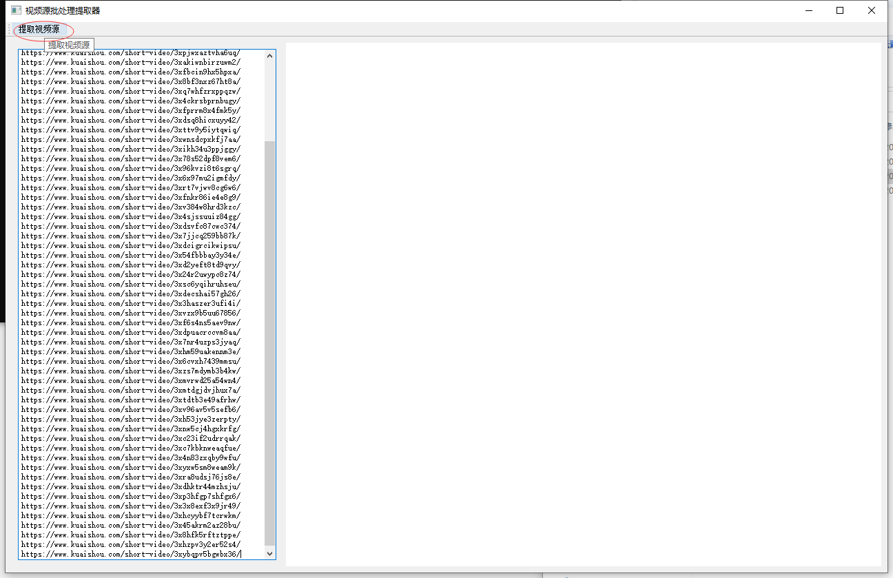

# video_down

快手、抖音，短视频批量下载工具。

## 工具使用说明

- 先进入到目标主页，下拉加载所有视频出来

- 然后点击F12，选择作品列表的ul标签内代码，复制出来

- 
- 

- 放入作品读取工具，读取出所有作品地址

- 

- 将作品地址放入批量下载工具，点击"提取视频"，选择下载目录，然后开始批量下载

- 

- （说明：若下载中提示验证码，需手动选择验证码，然后就可以继续下载。）

## 工具下载地址

- 打包好的工具就在本仓库：

- 作品读取工具：[https://github.com/sctm002/video_down/blob/main/%E6%8F%90%E5%8F%96%E8%A7%86%E9%A2%91%E9%93%BE%E6%8E%A5.exe]

- 视频下载工具(由于文件大小限制，该压缩包还需下载“视频批量下载.z01”这个文件，才能一起解压。)：
 [https://github.com/sctm002/video_down/blob/main/%E8%A7%86%E9%A2%91%E6%89%B9%E9%87%8F%E4%B8%8B%E8%BD%BD.zip]
 [https://github.com/sctm002/video_down/blob/main/%E8%A7%86%E9%A2%91%E6%89%B9%E9%87%8F%E4%B8%8B%E8%BD%BD.z01]

- 会python的就直接下代码在pycharm工具运行就可以了，不会的，或者图方便的就下载打包后的exe。

## 更新

- 更新了exe程序，现在抖音，快手都集成在一起了，避免说之前只能下载一种。   2024.11.05

## 声明

- 本代码仅用于学习分享，一切使用后果与本作者无关。

